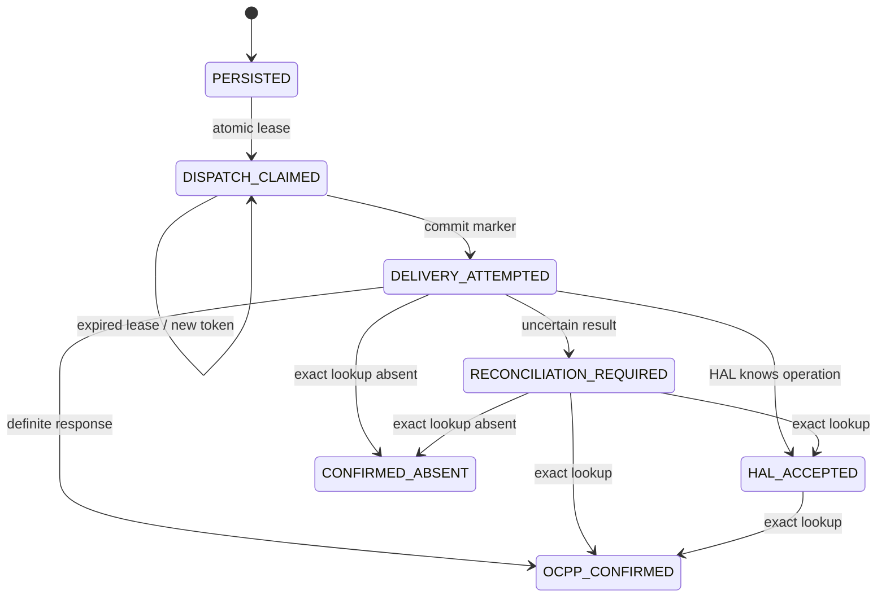

# Durable CMS charger-operation dispatch

## Boundary and states

CMS owns admission, the immutable dispatch envelope and recovery scheduling.
HAL owns OCPP delivery and its result. No charger-operation recovery step changes
charging sessions, financial state or authentication.

| CMS state | Durable meaning | Automatic action |
|---|---|---|
| `PERSISTED` | Accepted; no external delivery attempted | Claim and dispatch |
| `DISPATCH_CLAIMED` | Exclusively leased; no external delivery attempted | Wait for owner; reclaim only after lease expires |
| `DELIVERY_ATTEMPTED` | Marker committed before HAL I/O; delivery may have crossed the boundary | Exact-ID HAL lookup only |
| `HAL_ACCEPTED` | HAL knows this operation but no final OCPP result is available | Exact-ID HAL lookup only |
| `RECONCILIATION_REQUIRED` | Delivery/outcome remains uncertain | Exact-ID HAL lookup only |
| `OCPP_CONFIRMED` | HAL recorded the OCPP response | No dispatch; physical effect still comes from subsequent facts |
| `CONFIRMED_ABSENT` | HAL exact lookup reported this CMS operation absent | No replay |

The handler and worker both call `dispatchChargerOperation`. A conditional
PostgreSQL claim uses row locking and a fresh UUID token. Marking delivery must
match that token, state and unexpired lease. The transaction containing the
marker and `charger.operation_changed` event must commit before HAL is called.
A failed or uncertain commit never permits a send. No transaction spans network
I/O. Expiry cannot authorize a stale claimant after another dispatcher wins.

The dedicated HAL operation POST disables body rewind and redirects. This
prevents Go's automatic transport retry for POSTs carrying `Idempotency-Key`.
The existing HAL idempotency header remains, but CMS does not rely on it to
justify replay. A process crash after marking but before sending intentionally
leaves a possibly-delivered operation; conservative ambiguity is preferable to
a duplicate physical command.

## Immutable dispatch envelope

The row freezes `dispatch_charger_identity` and `dispatch_connector_number`
at admission. Existing immutable fields retain the CMS operation ID, trace ID,
CPO/charger/connector IDs, kind, parameters, requested configuration keys,
correlation ID and idempotency identity. Recovery never reconstructs a destination
from current inventory or mappings. A database guard rejects changes to these
inputs and removal/change of an existing delivery-attempt timestamp. It also
prevents a possibly-delivered row returning to either pre-delivery state.

Concurrent requests with the same CPO/idempotency key use the existing unique
constraint. Same digest and charger return the winner; changed input/charger
returns `idempotency_conflict`. Retrying an existing operation can only dispatch
it while it remains legally unattempted and claimable.

## Reconciliation and completion

`halops.ReconcileChargerOperation` performs an exact CMS-ID HAL GET without
writing CMS business state. CPO records the result and event atomically. HAL's
own `PERSISTED` and `DELIVERY_ATTEMPTED` mean HAL has accepted the operation;
they map to CMS `HAL_ACCEPTED`, never CMS `PERSISTED`.

The per-row `recovery_token` fences stale reconciliation responses. A newer
reservation/result cannot be overwritten by an older lookup or late transport
error. `completed_at` remains null for every nonterminal CMS state, even if HAL
supplies a timestamp for an ambiguous result. Confirmed absence is terminal
without proving physical success and never authorizes replay.

Detail GET retains read-triggered reconciliation for due uncertain/HAL-accepted
rows. The history list remains side-effect-free. Both share the background
reconciler's reservation/backoff, so repeated GETs cannot flood HAL or query an
active synchronous attempt immediately.

## Worker and failures

`charger-operation-recovery` starts with CMS when HAL is configured and is a
required, heartbeat-observed worker. Each process runs one sequential dispatcher:
maximum 25 due rows per pass, a 5-second polling interval, a 30-second pass
budget, 30-second pre-delivery claims, 15-second per-call ceiling (the configured
HAL HTTP timeout can be shorter), and 1-minute reconciliation/retry spacing.
The network deadline starts before committing the delivery marker; a paused
owner cannot resume with a fresh send budget after the reconciliation grace.
Shutdown cancels and joins this worker before the database closes.

Rows are selected oldest-due first. Claim/reservation/backoff writes move work
behind other due rows. Poison rows are isolated, logged using operation UUID
and a bounded category, and leave durable state for another iteration. Invalid
frozen inputs stay unattempted with `invalid_dispatch_snapshot`; no partially
reconstructed request is sent. No unbounded goroutines or retry loop exists.
Multi-instance row ownership and lease/scheduling time use PostgreSQL rather
than in-process locks or independent CMS clocks.

## Migration and operator recovery

Migration `000070_durable_charger_operation_dispatch` adds the snapshot,
lease/token, attempt evidence, scheduling fields and partial recovery index.
Old `PERSISTED` did not prove absence of delivery. The migration therefore moves
those rows to `RECONCILIATION_REQUIRED` with `legacy_delivery_unknown`, without
inventing a historical mapping or attempt timestamp. It clears misleading
completion timestamps on legacy nonterminal rows.

For an authorized future rollout, quiesce all old CMS writers before migrating
and starting the new version. Never run the old unfenced dispatcher against this
schema. The down migration refuses to remove the safety boundary while any
charger-operation records exist; use a forward correction, not deletion of
operation history to force rollback. No deployment is part of this change.

Inspect operation detail/history, worker health, failure category, lease expiry,
`recovery_after` and exact HAL-ID evidence when diagnosing stalled work. Do not
reset an attempted/uncertain/absent row to `PERSISTED`, edit frozen input, or
invent a new idempotency key to retry an ambiguous command. Resolve uncertainty
through HAL evidence. A genuinely new operator instruction is a separate
operation with separate authorization, never automatic recovery of an old one.

## Verification boundary

Focused tests use disposable PostgreSQL and a loopback HAL HTTP stub. They
exercise crashes before claim/marker/call/result, failed marker COMMIT, lease
fencing, concurrent request/worker claims, idempotency races, transport ambiguity,
HAL result/absence, raw HAL queue states, immutable mapping drift, batch limits,
poison isolation, event transactions, migration conservatism and cancellation.
This verifies the CMS boundary; it is not hardware OCPP or deployed HAL proof.
